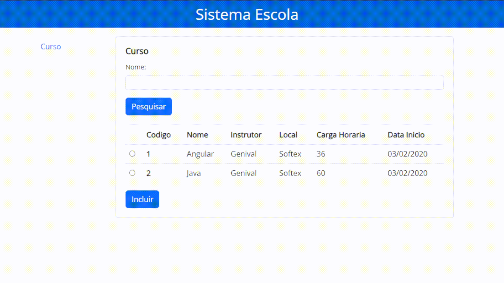

### SistemaEscola

Projeto desenvolvido para construir uma tela para pesquisa e inclusão de curso utilizando conceitos de SPA através do framework Angular.

Made by Nataniel Souza

### Tecnologias utilizadas

 [Angular CLI](https://github.com/angular/angular-cli) version 15.1.1. 
 Visual Studio Code  
 Bootstrap version 5.3.0-alpha1  
 Node.js

### Preview

### Contacts

📧 Email: nt.s@live.com   
👤 LinkedIn: [Nataniel Souza](https://www.linkedin.com/in/nataniel-souza)

